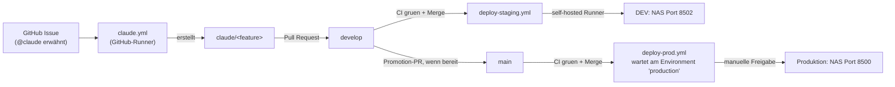

# Entwicklungsworkflow Sportfest-Manager

Diese Datei beschreibt den GitHub-basierten Entwicklungsprozess: wie eine
Änderung von einem Issue bis in Produktion kommt, welche GitHub Actions dabei
laufen, wo der self-hosted Runner steht und wie man im Notfall zurückrollt.
Für die fachlichen Funktionen der App selbst siehe [`DOKUMENTATION.md`](../DOKUMENTATION.md).

## 1. Architekturüberblick

Es gibt drei Umgebungen:

| Umgebung | Ort | Branch | Port | Datenbank |
|---|---|---|---|---|
| Lokal / Feature | beliebiger eigener Klon (Laptop, anderes Gerät) | `develop` / `claude/<feature>` | frei wählbar | eigene `data/sportfest.db` |
| DEV (Staging) | NAS `/volume1/docker/sportfest-app-dev` (eigenständiger Klon, kein Worktree) | `develop` | 8502 | eigene `data/sportfest.db`, Security immer aus |
| Produktion | NAS `/volume1/docker/sportfest-app` = `Z:\sportfest-app` (Windows-Freigabe) | `main` | 8500 | Live-Datenbank |

DEV und Produktion laufen als getrennte Docker-Compose-Stacks
(`docker-compose.dev.yml` bzw. `docker-compose.yml`) mit eigenem Container,
eigener Datenbank und eigenem Docker-Subnetz — keine geteilten Ressourcen.

## 2. Branch-Strategie

- **`main`** — Produktion. Nur per Pull Request (aus `develop`) beschreibbar,
  branch-protected (grüner `ci`-Check erforderlich, kein Direkt-Push, auch
  nicht für den Repo-Owner).
- **`develop`** — Entwicklungsstand, entspricht der DEV-Umgebung. Ebenso
  branch-protected.
- **`claude/<feature>`** — von Claude automatisiert erzeugte Feature-Branches,
  Ziel ist immer ein PR gegen `develop`.

Wann `develop` nach `main` promotet wird, entscheidet der Nutzer bewusst
(eigener Pull Request `develop` → `main`), unabhängig vom laufenden
Feature-Betrieb auf `develop`.

## 3. GitHub Actions im Detail

Alle Workflows liegen unter `.github/workflows/`.

### `ci.yml`

- **Trigger:** jeder Pull Request, jeder Push auf `main`/`develop`.
- **Läuft auf:** GitHub-Runner (`ubuntu-latest`), keine Secrets nötig.
- **Job `test`:** installiert `requirements-dev.txt`, führt `pytest tests -v`
  aus.
- **Job `docker`:** baut das produktionsidentische `Dockerfile`
  (`docker build .`), startet den Container und prüft per `curl` gegen die
  öffentliche Startseite (`/`), ob die App tatsächlich hochkommt — damit ein
  kaputtes Image nicht erst beim echten Deploy auffällt.

### `deploy-staging.yml`

- **Trigger:** Push auf `develop` (= Merge eines PRs).
- **Läuft auf:** self-hosted Runner (NAS).
- Aktualisiert `/volume1/docker/sportfest-app-dev` (klont beim allerersten
  Lauf selbst) und startet `docker-compose.dev.yml` neu.
- Läuft **automatisch und ohne Rückfrage** — DEV ist bewusst der Ort, an dem
  jede gemergte Änderung sofort sichtbar sein soll.

### `deploy-prod.yml`

- **Trigger:** Push auf `main`.
- **Läuft auf:** self-hosted Runner (NAS).
- Der Job hängt am GitHub-Environment `production`, das einen **Required
  Reviewer** verlangt. Der Workflow startet zwar sofort, der eigentliche
  Deploy-Schritt pausiert aber in "Waiting"-Status, bis der Nutzer in GitHub
  (Web-UI oder Mobile-App, inkl. Push-Benachrichtigung) auf "Approve and
  deploy" klickt. Erst danach wird `/volume1/docker/sportfest-app`
  aktualisiert und `docker-compose.yml` neu gestartet.
- **Produktion wird dadurch nie automatisch verändert**, unabhängig davon,
  wie viele Merges auf `main` passieren.

### `claude.yml`

- **Trigger:** `@claude` in einem Issue-Kommentar, einem neu erstellten Issue,
  oder einem PR-Review-Kommentar.
- **Läuft auf:** GitHub-Runner, **nicht** auf dem self-hosted NAS-Runner —
  der bleibt ausschließlich fürs Deployment reserviert.
- Nutzt `secrets.ANTHROPIC_API_KEY` und die `anthropics/claude-code-action`.
- Claude erstellt einen `claude/<...>`-Branch gegen `develop`, implementiert
  die im Issue beschriebene Änderung, ergänzt Tests unter `tests/` und öffnet
  einen Pull Request. Claude merged nie selbst.
- **Einrichtung (einmalig, nur der Repo-Owner kann das tun, da es ein
  GitHub-App-Consent-Vorgang ist):** entweder lokal in einer interaktiven
  Claude-Code-Session `/install-github-app` ausführen, oder die "Claude"
  GitHub App manuell installieren und `ANTHROPIC_API_KEY` als Repo-Secret
  hinterlegen (siehe Abschnitt 8).

## 4. Self-hosted Runner

- Läuft als Docker-Container auf der Synology (192.168.178.20), registriert
  als `synology-sportfest`.
- **Ausschließlich für Deployment reserviert** (`deploy-staging.yml`,
  `deploy-prod.yml`). Tests und Docker-Build laufen bewusst auf
  GitHub-eigenen Runnern, damit der NAS-Runner nicht durch CI-Last blockiert
  wird und keine Fremdcode-Ausführung (z. B. aus PRs von Forks) auf dem
  eigenen NAS stattfindet.
- Status prüfen: `gh api repos/samuelmoede/sportfest-app/actions/runners`
  (Feld `status`: `online`/`offline`).
- Ist der Runner offline, bleiben `deploy-staging`- und `deploy-prod`-Läufe
  in der Warteschlange hängen, bis er wieder online ist — auf der Synology
  prüfen, ob der Runner-Container läuft, ggf. neu starten.

## 5. Ablauf: Issue → PR → Merge → DEV-Deploy

1. Issue anlegen (auch per Handy über die GitHub-App), Funktion beschreiben,
   `@claude` erwähnen.
2. `claude.yml` läuft an, Claude analysiert den Code, erstellt einen
   `claude/<feature>`-Branch, implementiert, ergänzt Tests, öffnet einen PR
   gegen `develop`.
3. `ci.yml` prüft den PR automatisch (Tests + Docker-Build/Healthcheck).
4. Nutzer liest den PR-Diff, mergt selbst (kein Auto-Merge).
5. `deploy-staging.yml` läuft automatisch an, DEV auf Port 8502 wird
   aktualisiert.
6. Nutzer testet über WireGuard (siehe Abschnitt 6).
7. Wenn zufrieden: eigener Promotion-PR `develop` → `main`.
8. Nach Merge auf `main` wartet `deploy-prod.yml` auf die manuelle Freigabe
   im Environment `production` (Abschnitt 3) — erst dann geht die Änderung
   live.

## 6. WireGuard-Test

- Über die bestehende WireGuard-VPN-Verbindung ins Heimnetz ist die
  DEV-Umgebung unter `http://192.168.178.20:8502` erreichbar.
- DEV läuft standardmäßig **ohne Login** (`SPORTFEST_SECURITY_ENABLED=false`
  fest in `docker-compose.dev.yml`, unabhängig vom Wert in einer eventuell
  aus Prod kopierten Datenbank — die Env-Var hat laut `settings_service.py`
  Vorrang).
- DEV hat eine eigene, von Produktion getrennte SQLite-Datenbank — Testdaten
  dort haben keine Auswirkung auf Produktion.

## 7. Rollback

**DEV:**
- Einfachster Weg: einen neuen Commit/Revert-PR gegen `develop` mergen — löst
  automatisch einen neuen `deploy-staging`-Lauf aus.
- Alternativ direkt auf dem NAS im Ordner `/volume1/docker/sportfest-app-dev`
  `git reset --hard <vorheriger-commit>` und `docker compose -f
  docker-compose.dev.yml up -d --build` manuell ausführen (überschreibt den
  Ordner bis zum nächsten Push auf `develop` wieder).

**Produktion:**
- Vor der Freigabe: die Environment-Freigabe im Environment `production`
  einfach nicht erteilen ("Reject") — dann passiert gar nichts.
- Nach einem bereits freigegebenen, aber fehlerhaften Deploy: `git revert`
  des betreffenden Commits auf `main` per neuem Pull Request (kein
  `--force`-Push auf `main` möglich, da branch-protected), danach den neuen
  `deploy-prod`-Lauf wie gewohnt manuell freigeben.
- Datenbank-Rollback: `python backup_database.py` legt regelmäßig Kopien
  unter `data/backups/` an; im Ernstfall die aktuelle `data/sportfest.db`
  gegen eine Backup-Kopie austauschen (Container vorher stoppen).

## 8. Benötigte Secrets

| Secret | Zweck | Wo gesetzt |
|---|---|---|
| `ANTHROPIC_API_KEY` | `claude.yml` — Claude Code GitHub Action | Repo → Settings → Secrets and variables → Actions |

Es werden **keine** Produktiv-Zugangsdaten oder Server-Credentials als
GitHub Secret hinterlegt — die Deploy-Workflows laufen auf dem self-hosted
Runner direkt auf der Ziel-NAS und brauchen dafür keine Secrets (lokaler
`git`/`docker compose`-Zugriff genügt).

## 9. Neuen Entwickler einrichten

1. Repo klonen: `git clone https://github.com/samuelmoede/sportfest-app.git`
2. `develop` auschecken: `git checkout develop`
3. Virtuelle Umgebung anlegen, `pip install -r requirements-dev.txt`
4. Tests laufen lassen: `python -m pytest tests -v`
5. Feature-Branch von `develop` abzweigen, Änderungen vornehmen, Tests
   ergänzen, Pull Request gegen `develop` öffnen.
6. Kein Zugriff auf NAS, Runner oder Produktion nötig — CI läuft vollständig
   auf GitHub-Runnern.
